# python_labs
# Лабораторная работа 1
## Задание 1
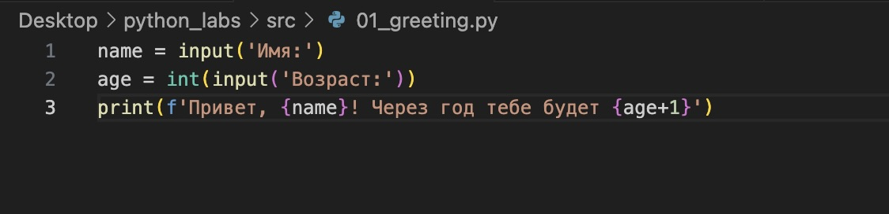
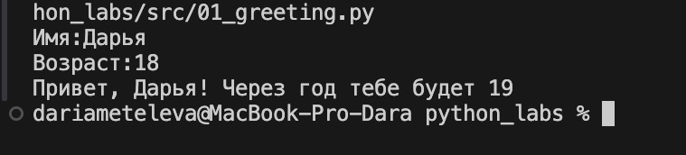

## Задание 2
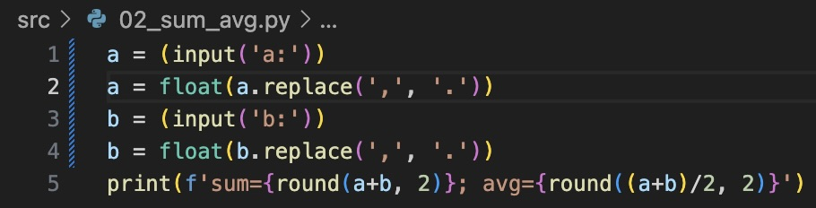
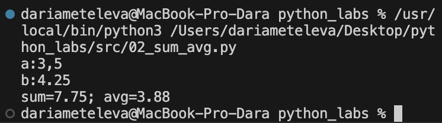

## Задание 3
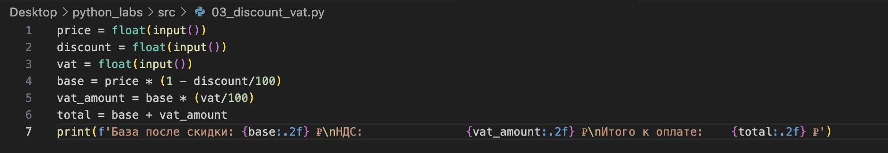
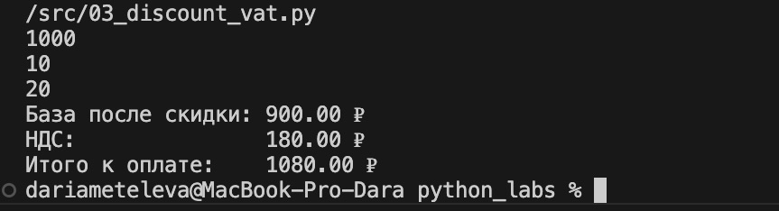

## Задание 4
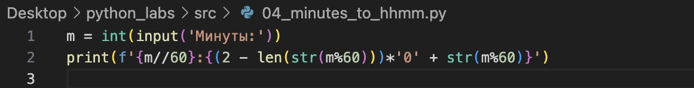
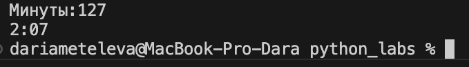

## Задание 5
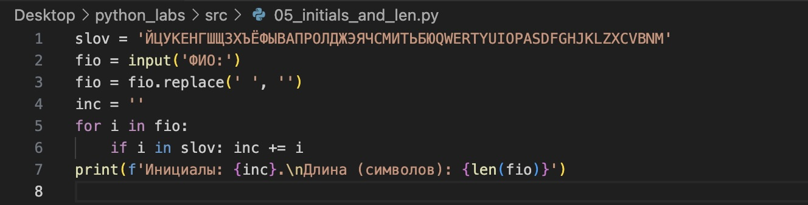
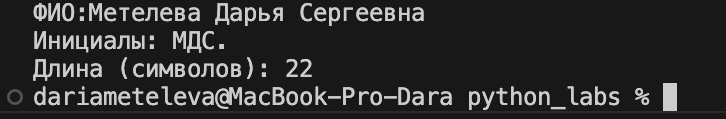

## Задание 6
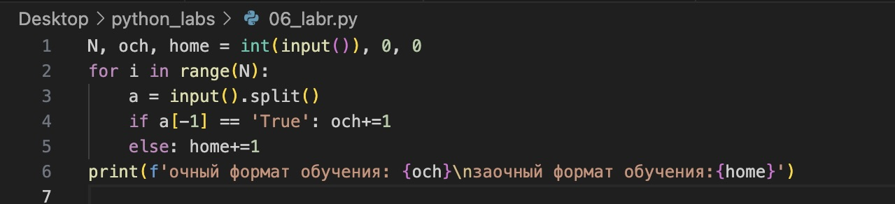
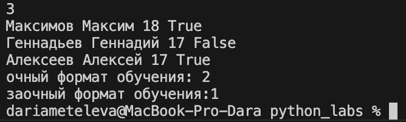

## Задание 7
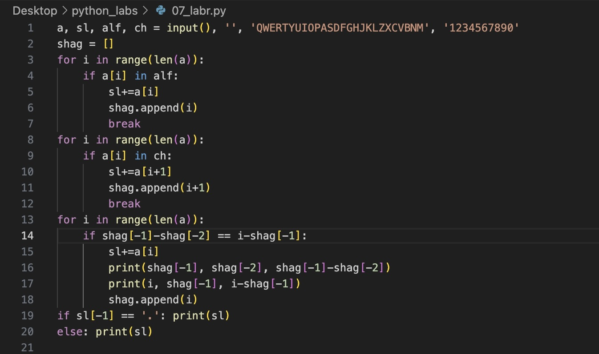
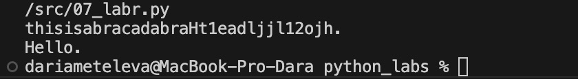

# Лабораторная работа 2

## Задание 1 - arrays
### min_max
```python
test_m_m = [
    [3, -1, 5, 5, 0],
    [42],
    [-5, -2, -9],
    [],
    [1.5, 2, 2.0, -3.1]
]
def min_max(nums: list[float | int]) -> tuple[float | int, float | int]:
    if len(nums) == 0: 
        return 'ValueError'
    return (min(nums), max(nums)) 
for i in test_m_m:
    print(min_max(i))
```
### unique_sorted
```python
test_u_s = [
    [3, 1, 2, 1, 3],
    [],
    [-1, -1, 0, 2, 2],
    [1.0, 1, 2.5, 2.5, 0]
]
def unique_sorted(nums2: list[float | int]) -> list[float | int]:
    if len(nums2) == 0: 
        return 'ValueError'
    return sorted(set(nums2))
for i in test_u_s:
    print(unique_sorted(i))
```

### flatten
```python
fl_test = [
    [[1, 2], [3, 4]],
    ([1, 2], (3, 4, 5)),
    [[1], [], [2, 3]],
    [[1, 2], "ab"]
]
def flatten(mat: list[list | tuple]) -> list:
    result = []
    for a in mat:
        if isinstance(a, (list, tuple)): result.extend(flatten(a))
        else:
            if type(a) == int or type(a) == float: result.append(a)
            else: return 'TypeError'
    return result
for i in fl_test:
    print(flatten(i))
```
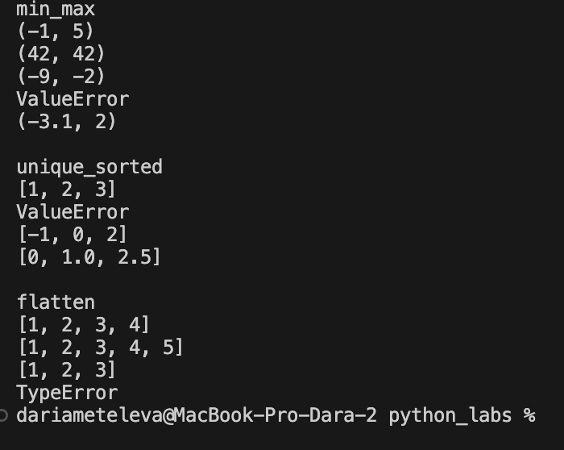

## Задание 2 - matrix
### transpose
```python

test_t = [
    [[1, 2, 3]],
    [[1], [2], [3]],
    [[1, 2], [3, 4]],
    [],
    [[1, 2], [3]]
]


def transpose(mat: list[list[float | int]]) -> list[list]:
    if not mat:
        return []
    len_mat = len(mat[0])
    for i in mat:
        if len(i) != len_mat:
            return 'ValueError'

    len_column = len(mat[0]) 
    result_t = [[] for _ in range(len_column)]
    
    for str in range(len(mat)): 
        for column in range(len_column):  
            result_t[column].append(mat[str][column])  
    
    return result_t

for i in test_t:
    print(transpose(i))
```
### row_sums
```python
test_rs = [
    [[1, 2, 3], [4, 5, 6]],
    [[-1, 1], [10, -10]],
    [[0, 0], [0, 0]],
    [[1, 2], [3]]
]


def row_sums(mat: list[list[float | int]]) -> list[float]:
    res = []
    len_column = len(mat[0])
    for i in mat:
        if len(i) != len_column:
            return 'ValueError'
    for row in mat:
        row_sum = sum(row)
        res.append(row_sum)
    return res
for i in test_rs:
    print(row_sums(i))
```


### col_sums
```python
test_cs = [
    [[1, 2, 3], [4, 5, 6]],
    [[-1, 1], [10, -10]],
    [[0, 0], [0, 0]],
    [[1, 2], [3]]
]

def col_sums(mat: list[list[float | int]]) -> list[float]:
    result_cs = []
    len_str = len(mat[0])
    result_cs = [0] * len_str
    for i in mat:
        if len(i) != len_str:
            return 'ValueError'
        
    for column in mat:
        k = 0
        for strok in column:
            result_cs[k%len_str] = result_cs[k%len_str] + strok
            k+=1
    return result_cs
for i in test_cs:
    print(col_sums(i))
```


## Задание 3 - tuples
```python
test_input = [
    ("Иванов Иван Иванович", "BIVT-25", 4.6),
    ("Петров Пётр", "IKBO-12", 5.0),
    ("Петров Пётр Петрович", "IKBO-12", 5.0),
    ("  сидорова  анна   сергеевна ", "ABB-01", 3.999), 
    (' FJJ ', 'RR'),
    ('WER', 'Det', 52), 
    ('qw', '', 53.9)
]
def format_record(rec: tuple[str, str, float]) -> str: 
    if not isinstance(rec[2], float):
        return TypeError
    try: 
        len(rec)!= 3 or type(rec[0]) != str or type(rec[1]) != str or type(rec[2]) != float or len(rec[0])==0 or len(rec[1])==0 
    
        name, gr, gpa = rec
    
        name = name.split()
        if len(name) == 3: name = f'{name[0].title()} {name[1][0].upper()}.{name[1][0].upper()}.'
        else: name = f'{name[0].title()} {name[1][0].upper()}.'
        return f'{name}, гр. {gr}, GPA {gpa}'
    except:
        return TypeError

for i in test_input:
    print(format_record(i))
```
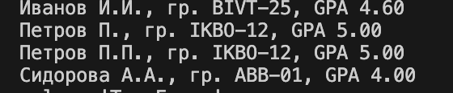


# Лабораторная работа 3
## text.py
* _файл для хранения функций_
```python
import re  

def normalize(text: str, *, casefold: bool = True, replacement: bool = True) -> str:
    if not text:
        return ''
    
    
    if casefold:
        text = text.casefold()
    
    if replacement:
        text = text.replace('ё', 'е').replace('Ё', 'Е')
    
    text = text.replace('\t', ' ').replace('\r', ' ').replace('\n', ' ')
    
    text = re.sub(r'\s+', ' ', text).strip()
    
    return text


def tokenize(text: str) -> list[str]:
    if not text:
        return []
    pattern = r'\w+(?:-\w+)*'
    tokens = re.findall(pattern, text)
    
    return tokens

def count_freq(tokens: list[str]) -> dict[str, int]:
    freq_dict = {}
    
    for token in tokens:
        freq_dict[token] = freq_dict.get(token, 0) + 1
    return freq_dict  

def top_n(freq: dict[str, int], n: int = 5) -> list[tuple[str, int]]:
    items = list(freq.items())
    sorted_items = sorted(items, key=lambda x: (-x[1], x[0]))
    return sorted_items[:n]
```
## text_stats.py
* _файл с реализацией функций_
```python
iimport sys
import os

sys.path.append(os.path.join(os.path.dirname(__file__), '..', 'lib'))
from text import normalize, tokenize, count_freq, top_n

sys.path.append(os.path.join(os.path.dirname(__file__)))
from test import normalize_test, tokenize_test, count_freq__top_n_test


for i in normalize_test:
    print(normalize(i))
for i in tokenize_test:
    print(tokenize(i))
for i in count_freq__top_n_test:
    print(count_freq(i))
    print(top_n(count_freq(i)))


def main():
    text = sys.stdin.readline().strip()  
    if not text:
        print("Всего слов: 0")
        print("Уникальных слов: 0")
        print("Топ-5:")
        return
    
    normalized = normalize(text)
    tokens = tokenize(normalized)
    
    total = len(tokens)
    unique = len(set(tokens))
    freq_dict = count_freq(tokens)
    top_words = top_n(freq_dict, 5)
    
    print(f"Всего слов: {total}")
    print(f"Уникальных слов: {unique}")
    print(f"Топ-{min(5, len(set(tokens)))}:")
    for word, count in top_words:
        print(f"{word}:{count}")

if __name__ == "__main__":
    main()

```
### test.py
* _файл с тестами_
```python
normalize_test = [
    "ПрИвЕт\nМИр\t",
    "ёжик, Ёлка",
    "Hello\r\nWorld",
    "  двойные   пробелы  "
]


tokenize_test = [
    "привет мир",
    "hello,world!!!",
    "по-настоящему круто",
    "2025 год",
    "emoji 😀 не слово"
] 


count_freq__top_n_test = [
    ["a","b","a","c","b","a"],
    ["bb","aa","bb","aa","cc"]
]

```


#### Вывод:
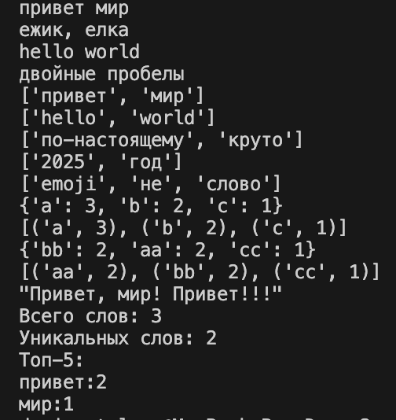

# Лабораторная работа 4


## файл io_txt_cvs.py
```python
mport csv
from pathlib import Path #для работы с путями файлов
from typing import Iterable, Sequence

def read_text(path: str | Path, encoding: str = 'utf-8') -> str: #чтение содержимого файла
    path = Path(path)
    if path.suffix.lower() != '.txt':
        raise ValueError(f"файл {path} должен иметь расширение .txt")
    return path.read_text(encoding=encoding)

def write_csv(rows: Iterable[Sequence], path: str | Path, header: tuple[str, ...] | None = None) -> None:
    path = Path(path)
    if path.suffix.lower() != '.csv':
        raise ValueError(f"файл {path} должен иметь расширение .csv")
    rows = list(rows)
    if rows:
        first_len = len(rows[0])
        for i, roww in enumerate(rows): #возвращает индекс, элемент
            if len(roww) != first_len:
                raise ValueError(f'Строка {i} имеет длину {len(roww)}, ожидалось {first_len}') 
            
    with path.open('w', newline='', encoding='utf-8') as f: #открытие файла для записи 
        w = csv.writer(f)
        if header is not None: #eсли передан заголовок
            w.writerow(header)
        for r in rows:
            w.writerow(r) # построчно записывает в csv


if __name__ == '__main__':
    print('тест')
    try:
        txt = read_text('data/lab04/input.txt')  # должен вернуть строку
        print(f'Прочитано {len(txt)} символов')
        print(f'Первые 50 символов: {txt[:50]}')
    except FileNotFoundError:
        print('Файл не нвйден')
    except Exception as e:
        print('ошибка при чтении {e}')
    
    try:
        write_csv([('word','count'),('test',3)], 'data/check.csv')  # создаст CSV
    except Exception as e:
        print('ошибка при создании CSV')
```


## файл text_report.py
```python
import sys
from pathlib import Path
from collections import Counter 
sys.path.insert(0, str((Path(__file__).parent.parent))) #добавлят корень проекта в начало списка
from lib.text import normalize, tokenize, top_n
from lab04.io_txt_csv import read_text, write_csv
def frequencies_from_text(text: str) -> dict[str, int]: #подсчитывает частоты слов
    tokens = tokenize(normalize(text))
    return Counter(tokens) 

def sorted_word_counts(freq: dict[str, int]) -> list[tuple[str, int]]: #сортировка по убыванию частоты, по авфавиту
    return sorted(freq.items(), key=lambda kv: (-kv[1], kv[0]))
def report(input_path: Path, output_path: Path, encoding: str = 'utf-8') -> dict[str, int]: #очтёт
    try:
        if input_path.suffix.lower() != '.txt':
            raise ValueError(f"входной файл должен быть .txt, получен: {input_path.suffix}")
        
        if output_path.suffix.lower() != '.csv':
            raise ValueError(f"выходной файл должен быть .csv, получен: {output_path.suffix}")
        text = read_text(input_path, encoding=encoding)
        if not text.strip():
            print('файл пустой')
            header = ('word', 'count')
            write_csv([], output_path, header)  # Только заголовок
            return ''     
        freq = frequencies_from_text(text)
        sorted_counts = sorted_word_counts(freq)
        header = ('word', 'count') #заголовок
        write_csv(sorted_counts, output_path, header)
        return freq
    except FileNotFoundError:
        print(f'FileNotFoundError')
        sys.exit(1) #завершение программы с ошибкой
        
    except Exception as e:
        print(f'ошибка обработки {e}')
        sys.exit(1)


def main():
    input_file = Path('data/lab04/input.txt')
    output_file = Path('data/lab04/report.csv') #путь для выхода
    print(f'...обработка файла: {input_file}')
    try:
        frequencies = report(input_file, output_file)
        sum_words = sum(frequencies.values()) #кол-во слов
        unique_words = len(frequencies) #кол-во уникальных слов
        top_words = top_n(frequencies, 5)        
        print(f'Всего слов: {sum_words}')
        print(f'Уникальных слов: {unique_words}')
        print('Топ-5:')

        for word, count in top_words:
            print(f'  {word}: {count}')
    except Exception as e:
        print(f'ошибка {e}')

if __name__ == '__main__':
    main()
```


## запуск 'Привет, мир! Привет!!!':

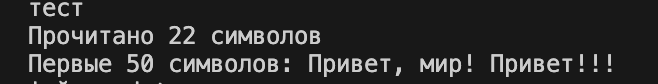


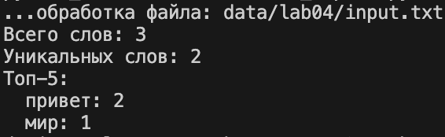


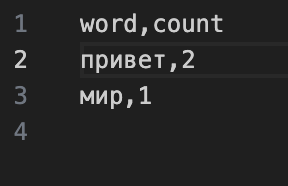
## запуск с пустым файлом input.txt:

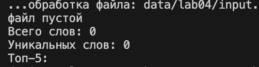


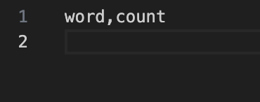

## запуск с отсутствием файла input.txt:

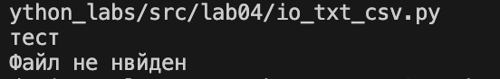


# Лабораторная работа 5

## файл json_csv.py
```python
import json
import csv
from pathlib import Path
def json_to_csv(json_path: str, csv_path: str) -> None:
    json_file = Path(json_path)
    csv_file = Path(csv_path)
    if not json_file.exists(): # проверка существует ли исходный JSON файл
        raise FileNotFoundError(f'JSON файл не найден: {json_path}')
    data = None # хранение данных из JSON
    
    try:
        with json_file.open('r', encoding='utf-8') as f: # чтение JSON файла
            data = json.load(f) # загружаем JSON данные
            
    except json.JSONDecodeError as e:
        raise ValueError(f'Неверный формат JSON в файле {json_path}: {str(e)}')
    except UnicodeDecodeError as e:
        raise ValueError(f'Проблема с кодировкой файла {json_path}: {str(e)}')
    
    # валидация структуры данных
    if not isinstance(data, list): # проверка, что данные являются списком
        raise ValueError(f'JSON должен содержать список объектов, получен {type(data).__name__}')
    if len(data) == 0:
        raise ValueError('Пустой JSON файл')
    
    for item in data: # проверка, что все элементы списка являются словарями
        if not isinstance(item, dict):
            raise ValueError(f'элемент/элементы не являются словарями')
    all_keys = set()
    for item in data:
        all_keys.update(item.keys()) # добавляем все ключи текущего словаря в множество
    
    if not all_keys: # если все словари пустые
        raise ValueError('JSON не содержит никаких полей (все словари пустые)')
    fieldnames = sorted(all_keys) 
    csv_file.parent.mkdir(parents=True, exist_ok=True) # создание директории для CSV файла, если она не существует
    
    try:
        with csv_file.open('w', encoding='utf-8', newline='') as f:
            writer = csv.DictWriter(f, fieldnames=fieldnames) # Создание DictWriter с определенными колонками
            writer.writeheader()# запись заголовока
            
            for item in data:
                row = {}
                for key in fieldnames:
                    row[key] = item.get(key, '')
                writer.writerow(row)
                
    except PermissionError as e:
        raise ValueError(f'Нет прав для записи в файл {csv_path}: {str(e)}')
    except Exception as e:
        raise ValueError(f'Ошибка при записи CSV файла: {str(e)}')

def csv_to_json(csv_path: str, json_path: str) -> None:
    csv_file = Path(csv_path)
    json_file = Path(json_path)
    
    try:
        with csv_file.open('r', encoding='utf-8', newline='') as f: 
            sample = f.read(1024) # определение диалекта
            dialect = csv.Sniffer().sniff(sample)
            f.seek(0) # возвращаемся к началу после sniff
            data = list(csv.DictReader(f, dialect=dialect))

        if not csv.Sniffer().has_header(sample):
                raise ValueError('CSV файл не содержит заголовка')
            
    except FileNotFoundError:
        raise FileNotFoundError('файл не найден')
    except Exception as e:
        raise ValueError(f'Ошибка при записи CSV файла: {str(e)}')
    if len(data) == 0:
        raise ValueError('Пустой JSON файл')
    
    try:
        with json_file.open('w', encoding='utf-8') as f:
            json.dump(data, f, ensure_ascii=False, indent=2)
                
    except PermissionError as e:
        raise ValueError(f'Нет прав для записи в файл {csv_path}: {str(e)}')
    except Exception as e:
        raise ValueError(f'Ошибка при записи CSV файла: {str(e)}')

if __name__ == '__main__':
    try:
        json_to_csv(
            'data/samples/people.json', 
            'data/out/people_from_json.csv'
        )
        print('тест json -> csv')
        csv_to_json(
            'data/samples/people.csv',
            'data/out/people_from_csv.json'
        )
        print('тест csv -> json')
    except Exception as e:
        print(f'Ошибка: {e}')
```
### результат работы: 

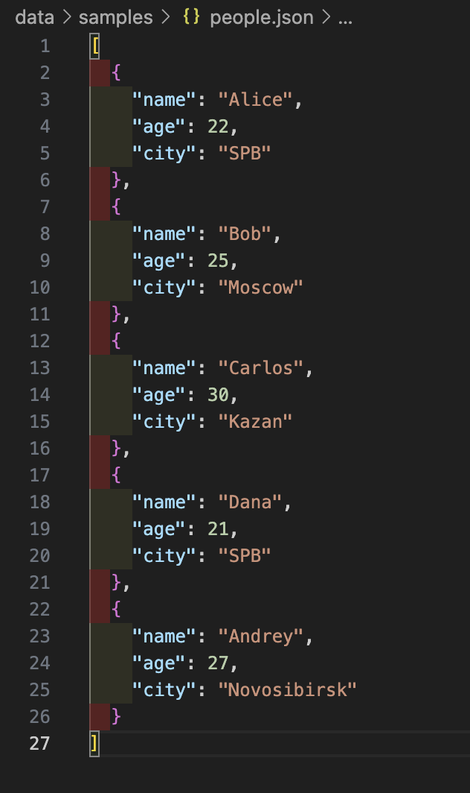

## ↓


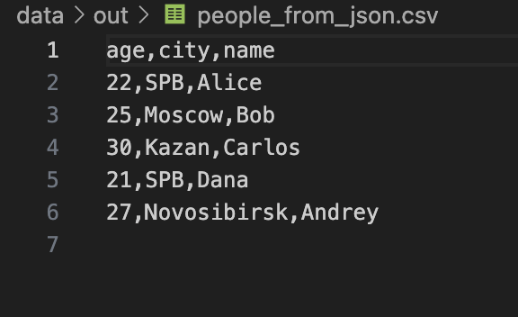
### _____________________________________________________


## ↓

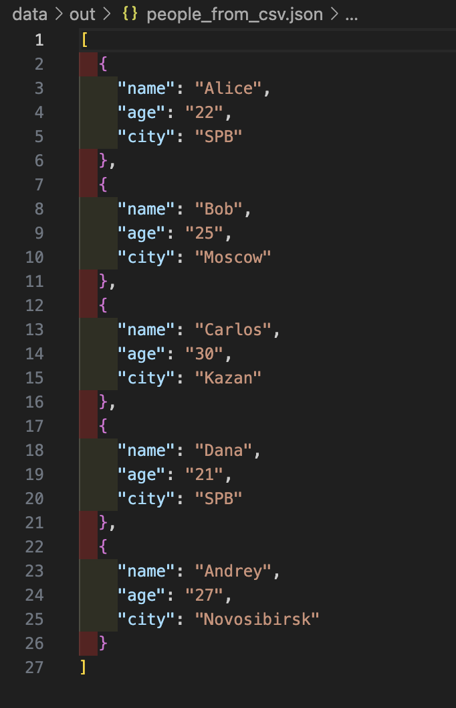


## файл csv_xlsx.py
```python
from openpyxl import Workbook
from openpyxl.utils import get_column_letter
import csv
from pathlib import Path


def column_width(worksheet): # автоматическая ширина колонок
    for column in worksheet.columns:
        max_length = 0
        column_letter = get_column_letter(column[0].column)
        
        #максимальная длина текста в колонке
        for cell in column:
            try:
                if cell.value is not None:
                    cell_length = len(str(cell.value))
                    if cell_length > max_length:
                        max_length = cell_length
            except:
                pass
        adjusted_width = max(max_length + 2, 8)  
        worksheet.column_dimensions[column_letter].width = adjusted_width


def csv_to_xlsx(csv_path: str, xlsx_path: str) -> None:
    csv_file = Path(csv_path)
    if not csv_file.exists():
        raise FileNotFoundError(f'CSV файл не найден: {csv_path}')
    if csv_file.suffix.lower() != '.csv':
        raise ValueError(f'Файл {csv_file} не csv')
    xlsx_file = Path(xlsx_path)
    if xlsx_file.suffix.lower() != '.xlsx':
        raise ValueError(f'Файл {xlsx_file} не xlsx')
    wb = Workbook()
    ws = wb.active
    ws.title = 'Sheet1' 
    try:
        with csv_file.open('r', encoding='utf-8', newline='') as f:
            csv_reader = csv.reader(f)

            for row_idx, row in enumerate(csv_reader, 1):
                for col_idx, value in enumerate(row, 1):
                    ws.cell(row=row_idx, column=col_idx, value=value)
        column_width(ws)
        xlsx_file = Path(xlsx_path)
        xlsx_file.parent.mkdir(parents=True, exist_ok=True)
        wb.save(xlsx_path)
        print(f'конвертировано CSV → XLSX: {csv_path} → {xlsx_path}')
        print(f'размер таблицы: {ws.max_row} × {ws.max_column}')
        
    except Exception as e:
        raise ValueError(f'Ошибка конвертации CSV -> XLSX: {str(e)}')
    

if __name__ == '__main__':
    try:
        csv_to_xlsx(
            'data/samples/people.csv',
            'data/out/people.xlsx'
        )
        print('Тест CSV → XLSX')
        
        csv_to_xlsx(
            'data/samples/cities.csv',
            'data/out/cities.xlsx'
        )
        print('Тест cities.csv → XLSX')
        
    except Exception as e:
        print(f'ошибка: {e}')
```

### результат работы: 


##                                              ↓


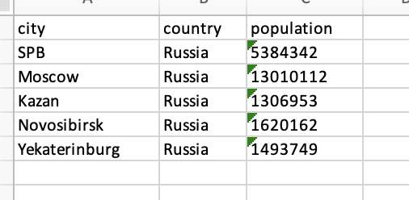

### _____________________________________________________
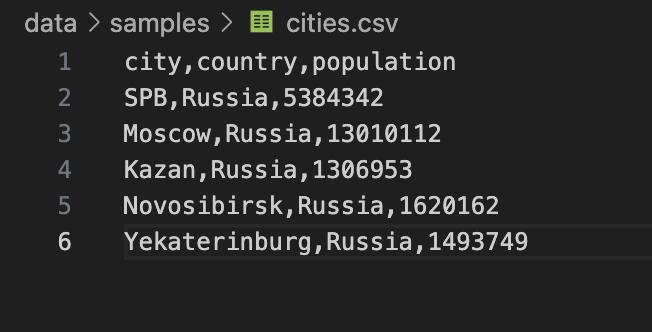

##                                              ↓


# Лабораторная работа 6
## файл cli_text.py
```python
import argparse
import sys
from pathlib import Path


from src.lib.text import normalize, tokenize, count_freq, top_n


# команда cat
def cmd_cat(path: Path, number: bool):
    if not path.exists():
        raise FileNotFoundError(f"файл не найден: {path}")

    with path.open("r", encoding="utf-8") as f:
        for i, line in enumerate(f, start=1):
            line = line.rstrip("\n")
            if number:
                print(f"{i} {line}")
            else:
                print(line)


# команда stats
def cmd_stats(path: Path, top: int):
    if not path.exists():
        raise FileNotFoundError(f"файл не найден: {path}")

    text = path.read_text(encoding="utf-8")
    normalized = normalize(text)  # нормализуем текст
    tokens = tokenize(normalized)  # разбиваем на слова
    freq = count_freq(tokens)  # считаем частоты
    top_words = top_n(freq, top)  # берём топ-n слов

    # выводим результаты
    print(f"всего слов: {len(tokens)}")
    print(f"уникальных слов: {len(set(tokens))}")
    print(f"топ-{top}:")
    for word, count in top_words:
        print(f"{word}:{count}")


# создаём парсер аргументов
def build_parser():
    parser = argparse.ArgumentParser(description="cli для cat и stats")
    sub = parser.add_subparsers(dest="cmd")

    # подкоманда cat
    p_cat = sub.add_parser("cat", help="вывести файл построчно")
    p_cat.add_argument("--input", required=True)
    p_cat.add_argument("-n", action="store_true", help="нумеровать строки")

    # подкоманда stats
    p_st = sub.add_parser("stats", help="анализ частот слов")
    p_st.add_argument("--input", required=True)
    p_st.add_argument("--top", type=int, default=5)

    return parser


# main - точка входа
def main(argv=None):
    argv = argv or sys.argv[1:]
    parser = build_parser()
    args = parser.parse_args(argv)

    try:
        if args.cmd == "cat":
            cmd_cat(Path(args.input), args.n)
        elif args.cmd == "stats":
            cmd_stats(Path(args.input), args.top)
        else:
            parser.print_help()
    except FileNotFoundError as e:
        parser.error(str(e))


if __name__ == "__main__":
    main()
```
## файл cli_convert.py
``` python
import argparse
import sys
from pathlib import Path

# импортируем функции из lab05 напрямую
from src.lab05.json_csv import json_to_csv, csv_to_json
from src.lab05.csv_xlsx import csv_to_xlsx


# создаём парсер аргументов
def build_parser():
    parser = argparse.ArgumentParser(description="конвертеры форматов")
    sub = parser.add_subparsers(dest="cmd")

    # json -> csv
    p1 = sub.add_parser("json2csv", help="конвертировать json->csv")
    p1.add_argument("--in", dest="input", required=True, help="входной файл (json)")
    p1.add_argument("--out", dest="output", required=True, help="выходной файл (csv)")

    # csv -> json
    p2 = sub.add_parser("csv2json", help="конвертировать csv->json")
    p2.add_argument("--in", dest="input", required=True, help="входной файл (csv)")
    p2.add_argument("--out", dest="output", required=True, help="выходной файл (json)")

    # csv -> xlsx
    p3 = sub.add_parser("csv2xlsx", help="конвертировать csv->xlsx")
    p3.add_argument("--in", dest="input", required=True, help="входной файл (csv)")
    p3.add_argument("--out", dest="output", required=True, help="выходной файл (xlsx)")

    return parser


def main(argv=None):
    argv = argv or sys.argv[1:]
    parser = build_parser()
    args = parser.parse_args(argv)

    try:
        if args.cmd == "json2csv":
            json_to_csv(args.input, args.output)
            print(f"{args.input} -> {args.output}")
        elif args.cmd == "csv2json":
            csv_to_json(args.input, args.output)
            print(f"{args.input} -> {args.output}")
        elif args.cmd == "csv2xlsx":
            csv_to_xlsx(args.input, args.output)
            print(f"{args.input} -> {args.output}")
        else:
            parser.print_help()
    except FileNotFoundError as e:
        parser.error(str(e))
    except Exception as e:
        parser.error(f"ошибка: {e}")


if __name__ == "__main__":
    main()
```
### терминал:
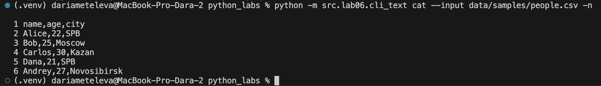

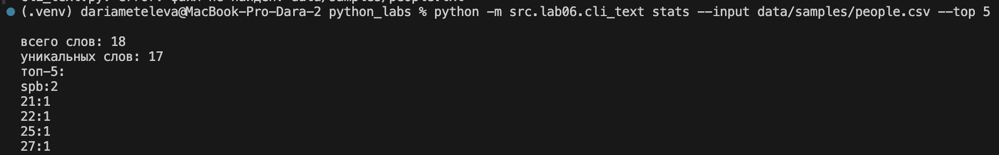

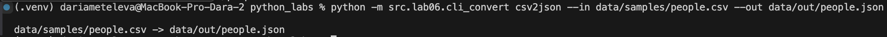


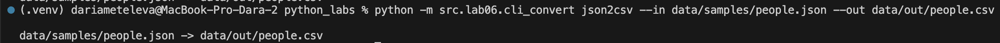

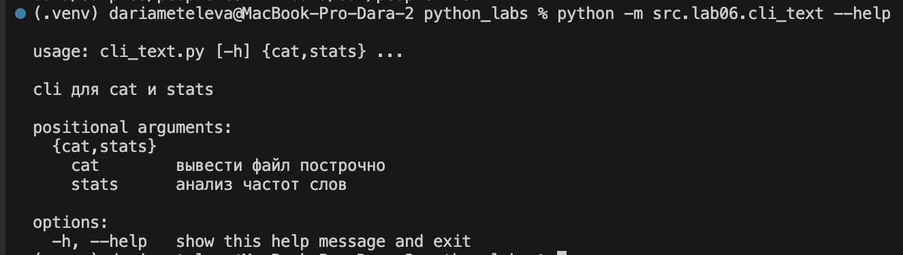


# Лабораторная работа 7
## файл test_text.py
```python
import pytest
from src.lib.text import normalize, tokenize, count_freq, top_n


@pytest.mark.parametrize(
    "source, expected",
    [
        ("ПрИвЕт\nМИр\t", "привет мир"),
        ("ёжик, Ёлка", "ежик, елка"),
        ("Hello\r\nWorld", "hello world"),
        ("  двойные   пробелы  ", "двойные пробелы"),
        ("", ""),
        ("\t\n\r  ", ""),
    ],
)
def test_normalize_basic(source, expected):
    assert normalize(source) == expected


@pytest.mark.parametrize(
    "source, expected",
    [
        ("привет мир", ["привет", "мир"]),
        ("hello,world!!!", ["hello", "world"]),
        ("по-настоящему круто", ["по-настоящему", "круто"]),
        ("2025 год", ["2025", "год"]),
        ("emoji 😀 не слово", ["emoji", "не", "слово"]),
        ("", []),
        ("   ", []),
        ("!!! ???", []),
    ],
)
def test_tokenize_basic(source, expected):
    assert tokenize(source) == expected


@pytest.mark.parametrize(
    "source, expected",
    [
        (["a", "b", "a", "c", "b", "a"], {"a": 3, "b": 2, "c": 1}),
        (["bb", "aa", "bb", "aa", "cc"], {"bb": 2, "aa": 2, "cc": 1}),
        ([], {}),
        (["same", "same", "same"], {"same": 3}),
    ],
)
def test_count_freq(source, expected):
    assert count_freq(source) == expected


@pytest.mark.parametrize(
    "source, expected",
    [
        ({"a": 3, "b": 2, "c": 1}, [("a", 3), ("b", 2), ("c", 1)]),
        ({"bb": 2, "aa": 2, "cc": 1}, [("aa", 2), ("bb", 2), ("cc", 1)]),
        ({}, []),  # пустой словарь
        ({"x": 5}, [("x", 5)]),
    ],
)
def test_top_n(source, expected):
    assert top_n(source) == expected
```
### терминал:
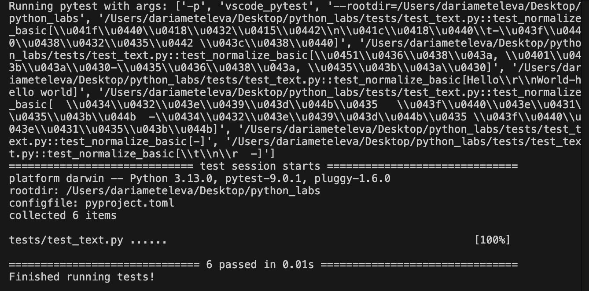


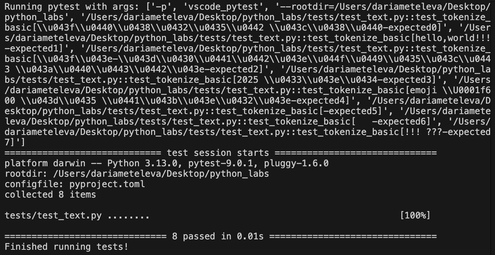

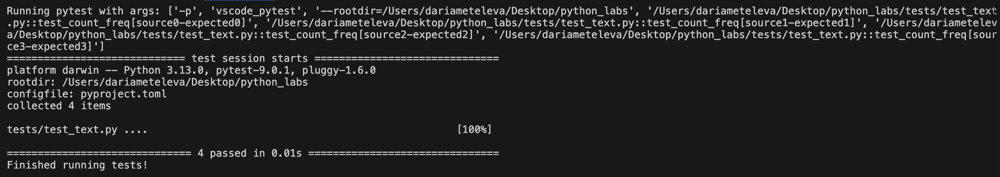

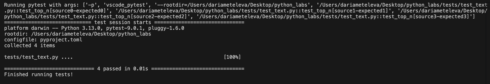


## файл test_json_csv.py
```python
import pytest
import json
import csv
from pathlib import Path
from src.lab05.json_csv import json_to_csv, csv_to_json


# позитивные сценарии
@pytest.mark.parametrize(
    "json_data, csv_fieldnames",
    [
        ([{"name": "Alice", "age": 22}, {"name": "Bob", "age": 25}], ["name", "age"]),
        ([{"item": "apple", "qty": 10}, {"item": "banana", "qty": 5}], ["item", "qty"]),
    ],
)
def test_json_to_csv_roundtrip(tmp_path: Path, json_data, csv_fieldnames):
    src_json = tmp_path / "src.json"
    dst_csv = tmp_path / "out.csv"
    roundtrip_json = tmp_path / "roundtrip.json"

    src_json.write_text(
        json.dumps(json_data, ensure_ascii=False, indent=2), encoding="utf-8"
    )

    # JSON -> CSV
    json_to_csv(str(src_json), str(dst_csv))
    assert dst_csv.exists()

    # CSV -> JSON
    csv_to_json(str(dst_csv), str(roundtrip_json))
    assert roundtrip_json.exists()

    # проверка, что количество записей и ключи совпадают
    with roundtrip_json.open(encoding="utf-8") as f:
        data_after = json.load(f)
    assert len(data_after) == len(json_data)
    for record in data_after:
        assert set(csv_fieldnames) <= set(record.keys())


# негативные сценарии
@pytest.mark.parametrize(
    "write_content, func",
    [
        ("", json_to_csv),  # пустой JSON
        ("{not: valid}", json_to_csv),  # некорректный JSON
        ("", csv_to_json),  # пустой CSV
        ("name,age\nAlice", csv_to_json),  # некорректный CSV
    ],
)
def test_invalid_files(tmp_path: Path, write_content, func):
    src = tmp_path / "input.file"
    dst = tmp_path / "output.file"
    src.write_text(write_content, encoding="utf-8")
    with pytest.raises(ValueError):
        func(str(src), str(dst))


@pytest.mark.parametrize("func", [json_to_csv, csv_to_json])
def test_nonexistent_file(tmp_path: Path, func):
    src = tmp_path / "does_not_exist.file"
    dst = tmp_path / "output.file"
    with pytest.raises(FileNotFoundError):
        func(str(src), str(dst))
```
### терминал:
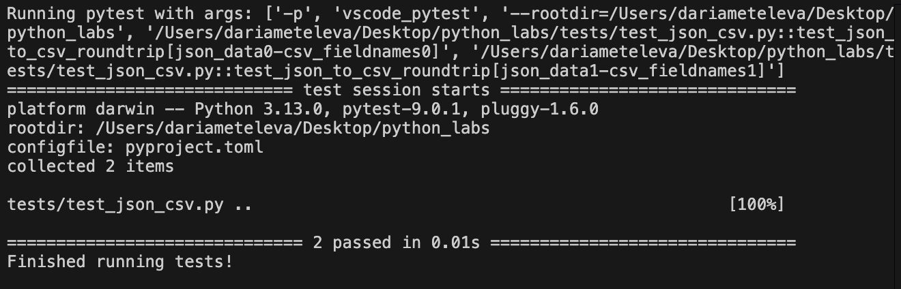

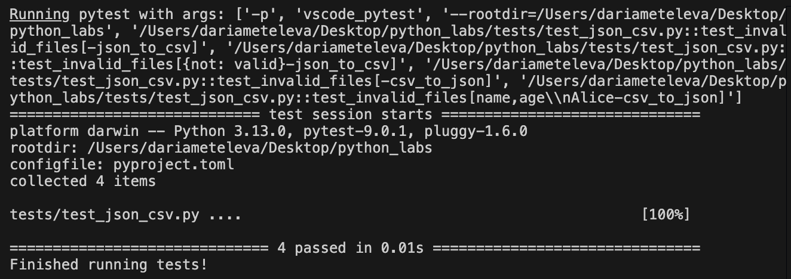

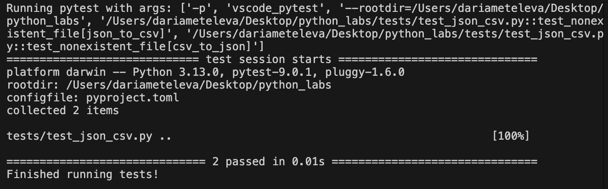


## Проверка на соответствие кода стилю black:

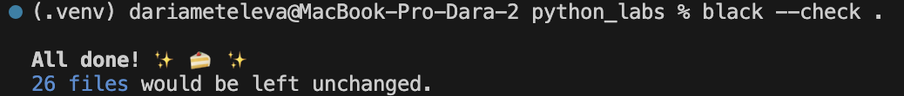 

# Лабораторная работа 8
## файл models.py:
```python
from dataclasses import dataclass    
from datetime import datetime, date
@dataclass
class Student:
    fio: str 
    birthdate: str 
    group: str 
    gpa: float 

    def __post_init__(self):
        try:
            datetime.strptime(self.birthdate, "%Y-%m-%d")
        except ValueError:
            raise ValueError(
                f"неверный формат даты рждения: '{self.birthdate}'. "
                "ожидается: YYYY-MM-DD"
            )
        if not (0 <= self.gpa <= 5):
            raise ValueError(f"GPA должен быть 0-5, получен: {self.gpa}")
        
    def age(self) -> int:
        birth = datetime.strptime(self.birthdate, "%Y-%m-%d").date()
        today = date.today()
        years = today.year - birth.year
        if (today.month, today.day) < (birth.month, birth.day):
            years -= 1
        return years

    def to_dict(self) -> dict:
        if not all([self.fio, self.birthdate, self.group, self.gpa is not None]):
            raise ValueError("некоторые поля отсутствуют")
        if not isinstance(self.fio, str):
            raise TypeError(f"ФИО должно быть строкой, получено: {type(self.fio).__name__}")
        if not isinstance(self.birthdate, str):
            raise TypeError(f"Дата рождения должна быть строкой, получено: {type(self.birthdate).__name__}")
        if not isinstance(self.group, str):
            raise TypeError(f"группа должна быть строкой, получено: {type(self.group).__name__}")
        if not isinstance(self.gpa, (int, float)):
            raise TypeError(f"GPA должен быть числом, получено: {type(self.gpa).__name__}")
        
        if not (0 <= self.gpa <= 5):
            raise ValueError(f"gpa must be between 0 and 5, got {self.gpa}")
        try:
            datetime.strptime(self.birthdate, "%Y-%m-%d")
        except ValueError:
            raise ValueError(
                f"birthdate format must be YYYY-MM-DD, got {self.birthdate}"
            )
        return {
            "fio": self.fio,
            "birthdate": self.birthdate,
            "group": self.group,
            "gpa": self.gpa
        }
    @classmethod
    def from_dict(clss, d: dict):
        return clss(
            fio=d.get("fio"),
            birthdate=d.get("birthdate"),
            group=d.get("group"),
            gpa=d.get("gpa"),
        )

    def __str__(self):
        return f"{self.fio}, {self.group}, GPA: {self.gpa}"

```

## файл serialize.py:
```python
import json
from typing import List
from .models import Student


def save_students_to_json(path: str, students: List[Student]):
    data = [s.to_dict() for s in students]
    with open(path, "w", encoding="utf-8") as f:
        json.dump(data, f, indent=4, ensure_ascii=False)


def load_students_from_json(path: str) -> List[Student]:
    with open(path, "r", encoding="utf-8") as f:
        data = json.load(f)
    return [Student.from_dict(item) for item in data]


if __name__ == "__main__":
    students = load_students_from_json("data/lab08/students_input.json")
    save_students_to_json("data/lab08/students_output.json", students)
    print("студенты, загруженные из students_input.json:")
    for student in students:
        print(student)
```

### сообщение в терминале о загрузке студентов: 

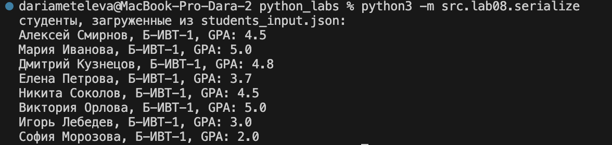


### приведение к стилю Black

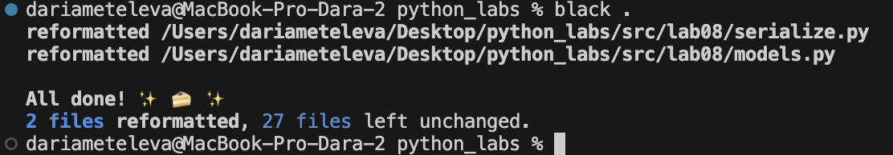

