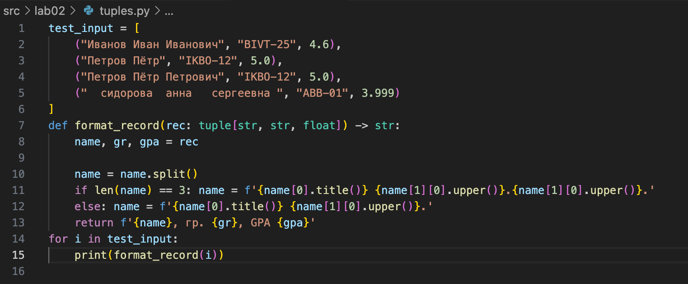

# python_labs
# Лабораторная работа 1
## Задание 1


## Задание 2


## Задание 3


## Задание 4


## Задание 5


## Задание 6


## Задание 7


# Лабораторная работа 2

## Задание 1 - arrays
### min_max
markdown 
```python
test_m_m = [
    [3, -1, 5, 5, 0],
    [42],
    [-5, -2, -9],
    [],
    [1.5, 2, 2.0, -3.1]
]
def min_max(nums: list[float | int]) -> tuple[float | int, float | int]:
    if len(nums) == 0: 
        return 'ValueError'
    return (min(nums), max(nums)) 
for i in test_m_m:
    print(min_max(i))
```
### unique_sorted
markdown
```python
test_u_s = [
    [3, 1, 2, 1, 3],
    [],
    [-1, -1, 0, 2, 2],
    [1.0, 1, 2.5, 2.5, 0]
]
def unique_sorted(nums2: list[float | int]) -> list[float | int]:
    if len(nums2) == 0: 
        return 'ValueError'
    return sorted(set(nums2))
for i in test_u_s:
    print(unique_sorted(i))
```

### flatten
markdown
```python
fl_test = [
    [[1, 2], [3, 4]],
    ([1, 2], (3, 4, 5)),
    [[1], [], [2, 3]],
    [[1, 2], "ab"]
]
def flatten(mat: list[list | tuple]) -> list:
    result = []
    for a in mat:
        if isinstance(a, (list, tuple)): result.extend(flatten(a))
        else:
            if type(a) == int or type(a) == float: result.append(a)
            else: return 'TypeError'
    return result
for i in fl_test:
    print(flatten(i))
```


## Задание 2 - matrix
markdown 
```python


## Задание 3 - tuples



