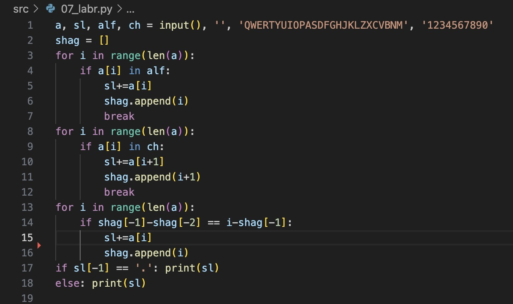

# python_labs
# Лабораторная работа 1
## Задание 1


## Задание 2


## Задание 3


## Задание 4


## Задание 5


## Задание 6


## Задание 7



# Лабораторная работа 2

## Задание 1 - arrays
### min_max
markdown 
```python
test_m_m = [
    [3, -1, 5, 5, 0],
    [42],
    [-5, -2, -9],
    [],
    [1.5, 2, 2.0, -3.1]
]
def min_max(nums: list[float | int]) -> tuple[float | int, float | int]:
    if len(nums) == 0: 
        return 'ValueError'
    return (min(nums), max(nums)) 
for i in test_m_m:
    print(min_max(i))
```
### unique_sorted
markdown
```python
test_u_s = [
    [3, 1, 2, 1, 3],
    [],
    [-1, -1, 0, 2, 2],
    [1.0, 1, 2.5, 2.5, 0]
]
def unique_sorted(nums2: list[float | int]) -> list[float | int]:
    if len(nums2) == 0: 
        return 'ValueError'
    return sorted(set(nums2))
for i in test_u_s:
    print(unique_sorted(i))
```

### flatten
markdown
```python
fl_test = [
    [[1, 2], [3, 4]],
    ([1, 2], (3, 4, 5)),
    [[1], [], [2, 3]],
    [[1, 2], "ab"]
]
def flatten(mat: list[list | tuple]) -> list:
    result = []
    for a in mat:
        if isinstance(a, (list, tuple)): result.extend(flatten(a))
        else:
            if type(a) == int or type(a) == float: result.append(a)
            else: return 'TypeError'
    return result
for i in fl_test:
    print(flatten(i))
```


## Задание 2 - matrix
### transpose
markdown 
```python

test_t = [
    [[1, 2, 3]],
    [[1], [2], [3]],
    [[1, 2], [3, 4]],
    [],
    [[1, 2], [3]]
]


def transpose(mat: list[list[float | int]]) -> list[list]:
    if not mat:
        return []
    len_mat = len(mat[0])
    for i in mat:
        if len(i) != len_mat:
            return 'ValueError'

    len_column = len(mat[0]) 
    result_t = [[] for _ in range(len_column)]
    
    for str in range(len(mat)): 
        for column in range(len_column):  
            result_t[column].append(mat[str][column])  
    
    return result_t

for i in test_t:
    print(transpose(i))
```
###row_sums
markdown
```python
print('\nrow_sums')
test_rs = [
    [[1, 2, 3], [4, 5, 6]],
    [[-1, 1], [10, -10]],
    [[0, 0], [0, 0]],
    [[1, 2], [3]]
]


def row_sums(mat: list[list[float | int]]) -> list[float]:
    res = []
    len_column = len(mat[0])
    for i in mat:
        if len(i) != len_column:
            return 'ValueError'
    for row in mat:
        row_sum = sum(row)
        res.append(row_sum)
    return res
for i in test_rs:
    print(row_sums(i))
```


### col_sums
markdown
```python
print('\ncol_sums')
test_cs = [
    [[1, 2, 3], [4, 5, 6]],
    [[-1, 1], [10, -10]],
    [[0, 0], [0, 0]],
    [[1, 2], [3]]
]

def col_sums(mat: list[list[float | int]]) -> list[float]:
    result_cs = []
    len_str = len(mat[0])
    result_cs = [0] * len_str
    for i in mat:
        if len(i) != len_str:
            return 'ValueError'
        
    for column in mat:
        k = 0
        for strok in column:
            result_cs[k%len_str] = result_cs[k%len_str] + strok
            k+=1
    return result_cs
for i in test_cs:
    print(col_sums(i))
```


## Задание 3 - tuples
markdown
```python
test_input = [
    ("Иванов Иван Иванович", "BIVT-25", 4.6),
    ("Петров Пётр", "IKBO-12", 5.0),
    ("Петров Пётр Петрович", "IKBO-12", 5.0),
    ("  сидорова  анна   сергеевна ", "ABB-01", 3.999)
]
def format_record(rec: tuple[str, str, float]) -> str:
    name, gr, gpa = rec
    
    name = name.split()
    if len(name) == 3: name = f'{name[0].title()} {name[1][0].upper()}.{name[1][0].upper()}.'
    else: name = f'{name[0].title()} {name[1][0].upper()}.'
    return f'{name}, гр. {gr}, GPA {gpa}'
for i in test_input:
    print(format_record(i))
```


